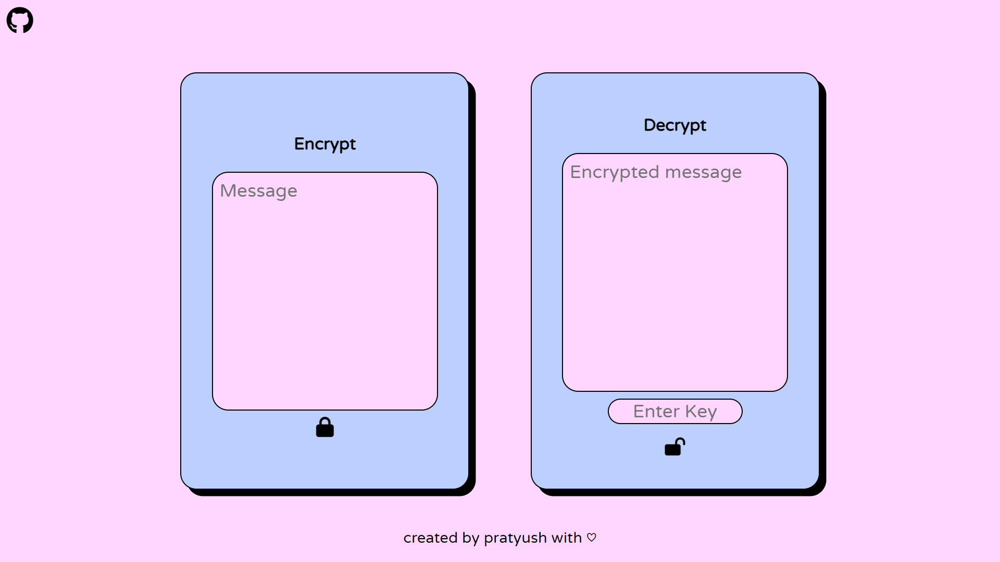

# Encrypt Decrypt Web Application

## Table of Contents
- [Introduction](#introduction)
- [Features](#features)
- [Demo](#demo)
- [Getting Started](#getting-started)
- [Usage](#usage)
- [Technologies Used](#technologies-used)
- [Contributing](#contributing)
- [Authors](#authors)

## Introduction

The Encrypt Decrypt Web Application is a simple web tool that allows users to encrypt and decrypt messages using AES encryption with a randomly generated key. It provides a user-friendly interface for secure message handling.

## Features

- **Message Encryption**: Encrypt any message with a randomly generated key.
- **Message Decryption**: Decrypt an encrypted message using the correct key.
- **Clipboard Copy**: Easily copy encrypted and decrypted messages, as well as encryption keys to the clipboard.
- **User-Friendly Interface**: A clean and intuitive interface for a seamless user experience.

## Demo
[Click here](https://pcoder.me/EncryptDecrypt/) to see a live demo of the Encrypt Decrypt Web Application.

## Getting Started

To get a copy of this project up and running on your local machine, follow these steps:

1. Clone the repository to your local machine:

    ```bash
    git clone https://github.com/pratyush-nirwan/EncryptDecrypt.git
    ```
2. Open the Project

    Navigate to the project folder using your terminal or file explorer:

    ```bash
    cd EncryptDecrypt
    ```
3. Launch the index.html file in your web browser.

## Usage

**Encrypting a Message:**

1. Enter your message in the "Message" textbox.
2. Click the "🔒" button.
3. The encrypted message and encryption key will be displayed.
4. You can copy the encrypted message and encryption key to your clipboard using the provided copy buttons.

**Decrypting a Message:**

1. Enter the encrypted message in the "Encrypted message" textbox.
2. Enter the encryption key in the "Enter Key" textbox.
3. Click the "🔓" button.
4. The decrypted message will be displayed.
5. You can copy the decrypted message to your clipboard using the provided copy button.

## Technologies Used

- HTML
- CSS
- JavaScript
- [CryptoJS](https://cryptojs.gitbook.io/docs/)

## Contributing

If you'd like to contribute to this project, please follow these steps:

1. Fork the repository.
2. Create a new branch for your feature or bug fix.
3. Make your changes and commit them.
4. Push your changes to your fork.
5. Create a pull request to the original repository.

## Authors

- Pratyush Nirwan

This project was created with ❤️ by Pratyush Nirwan.
